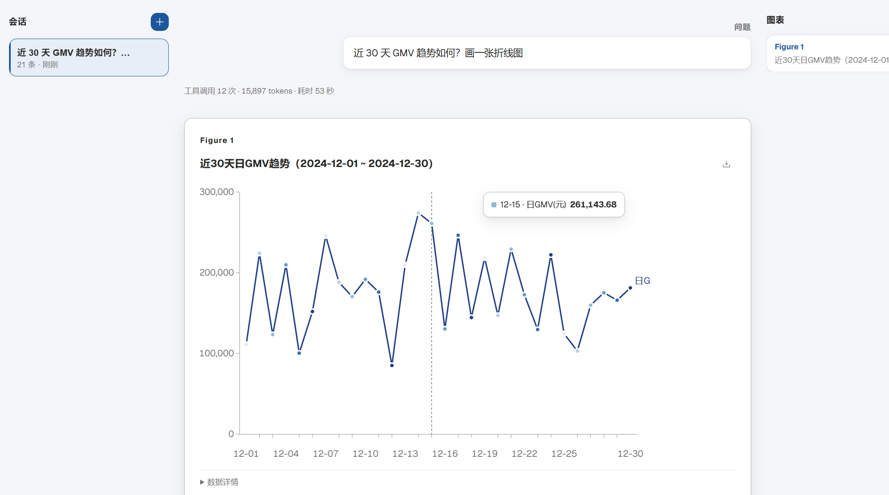

# 📊 数据分析智能体 · Data Analysis Agent

<p align="center">
  <!-- TODO: 放一张界面横幅截图，例如 docs/screenshot.png（三栏工作台 + 图表看板） -->
  
</p>

> **面向业务人员的多步骤开放式数据分析智能体：给一份数据，从数据质量探查、口径核验、指标计算到洞察与图表，一条对话完成——比 BI 平台更灵活，比直接问 LLM 更可信。**

## 这是什么？

一个基于 **LangGraph / DeepAgents** 构建的生产级业务数据分析师系统。业务人员用自然语言提问，Agent 自主完成：

- 前置探查数据质量（缺失 / 重复 / 非法日期），严格按口径文档计算指标
- 多维下钻、时序趋势（环比 / 同比）、分布对比、相关性分析
- 检索业务知识库（向量 + BM25 双路召回 → RRF 融合 → rerank 精排）为结论提供权威依据
- 生成带编号的 SVG 图表，支持导出 PNG / SVG / CSV



## Quick Start

### 方式一：Docker 部署（推荐，一条命令拉起全家）

前置要求：Docker（+Compose）、约 20GB 磁盘、一个 LLM API Key（任何 OpenAI 兼容网关均可）

```bash
git clone https://github.com/AnthonyXiang223/research_deepagent.git
cd research_deepagent
cp .env.example .env              # 编辑：填入你的 LLM key
./scripts/pull-base-images.sh     # 基础镜像（国内网络自动走镜像源）
./scripts/fetch_models.sh         # 嵌入模型 bge-m3 + reranker（约 6.5GB）
docker compose up -d --build
docker compose run --rm kb-init   # 首次：知识库分块+嵌入入库
```

浏览器打开 **http://localhost:5175**，开始提问。

### 方式二：本地开发模式

```bash
# 后端（项目根目录，依赖安装走清华镜像）
uv pip install --index-url https://pypi.tuna.tsinghua.edu.cn/simple -e .
.venv/bin/python -m uvicorn server.main:app --port 8000
# 前端（另一终端）
cd frontend-analyst && npm install && npm run dev
```

### 用自己的数据体验

1. 把 CSV 放进 `data/`，在 `data/datasets.yaml` 里写列级口径与指标定义
2. 口径文档（.docx）放进 `rag/`，重跑 `docker compose run --rm kb-init`
3. 重新提问——Agent 会按你的口径文档计算你的指标

## 

